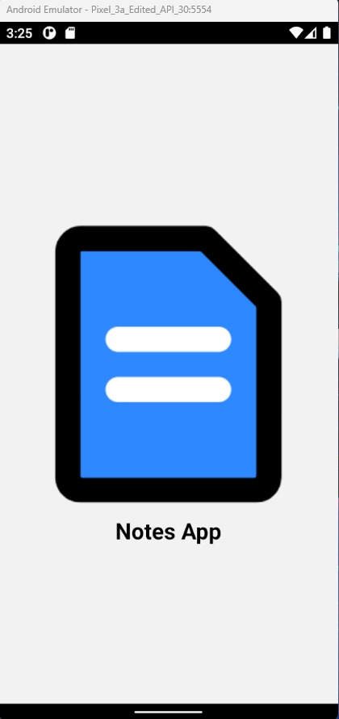
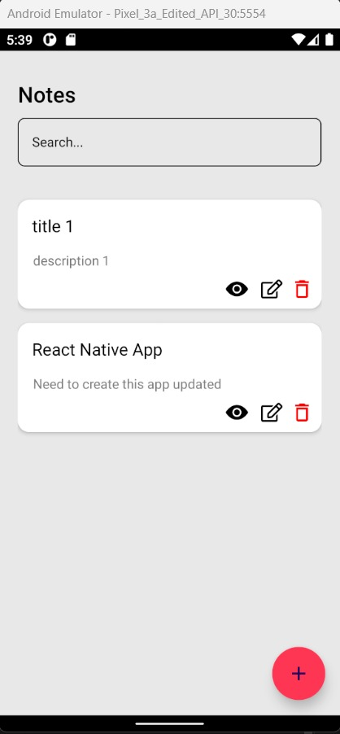
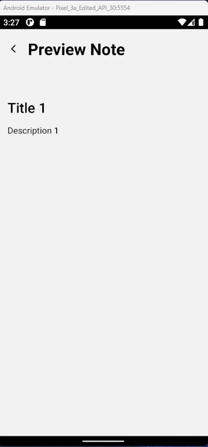
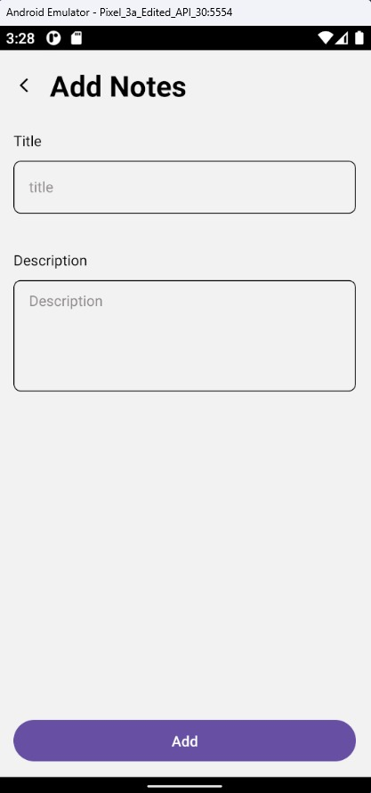
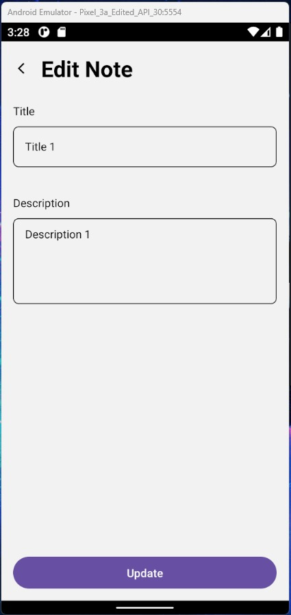

# Notes App

This is a simple React Native application for managing notes.

## Getting Started

To run the application, follow these steps:

1. Make sure you have Node.js installed on your machine.
2. Open a terminal window and navigate to the project directory.
3. Run the following command to start the application:

```bash
npx react-native start
```

## Features

- **Splash Screen**: Upon starting the app, you will see a splash screen.
- **Home Screen**: After the splash screen, the app will navigate to the Home Screen.
  - **Search Field**: Allows you to search for specific notes.
  - **Notes List**: Displays a list of all your notes.
  - **Add Notes Button**: Lets you add new notes to the list.
- **Note Cards**: Each note card includes:
  - Title
  - Description
  - Action Icons:
    - View: Allows you to view the details of the note.
    - Edit: Enables you to edit the note.
    - Delete: Deletes the note from the list.

## Technologies Used

- React Native
- JavaScript
- JSX
- Redux
- Redux-toolkit

## Screenshots






